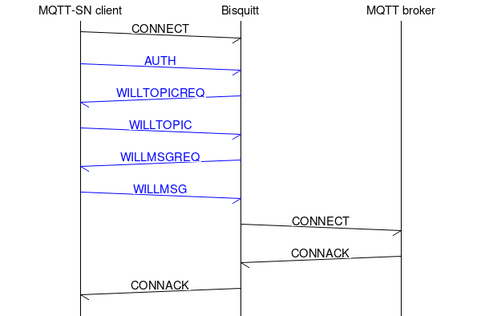

# Bisquitt Authentication Extension

Bisquitt implements a non-standard authentication extension based heavily on the
[MQTT-SN 2.0 draft] authentication mechanism. The authentication itself is not
performend by Bisquitt, but it is delegated to the MQTT server it is connected
to.

To use the extension on the gateway, enable it using the `--auth` command-line
option. To use it in the client, use the `--user` and `--password` command-line
options.

## `AUTH` message

[MQTT-SN 1.2] contains no authentication mechanism. The [MQTT-SN 2.0 draft]
introduces a new `AUTH` message type:

<table>
    <tr>
        <th>Bit</th>
        <th>7</th>
        <th>6</th>
        <th>5</th>
        <th>4</th>
        <th>3</th>
        <th>2</th>
        <th>1</th>
        <th>0</th>
    </tr>
    <tr>
        <td>Byte 1</td>
        <td colspan="8">Length</td>
    </tr>
    <tr>
        <td>Byte 2</td>
        <td colspan="8">Packet Type</td>
    </tr>
    <tr>
        <td>Byte 3</td>
        <td colspan="8">Auth Reason Code</td>
    </tr>
    <tr>
        <td>Byte 4</td>
        <td colspan="8">Auth Method Length (K)</td>
    </tr>
    <tr>
        <td>Byte 5:5+K</td>
        <td colspan="8">Auth Method</td>
    </tr>
    <tr>
        <td>Byte 6+K:N</td>
        <td colspan="8">Auth Data (N)</td>
    </tr>
</table>

The draft specifies the authentication exchange as follows (Section 6,
Authentication):

> To begin an authentication exchange, the Client sets the AUTH flag in the
> CONNECT packet. It then sends an AUTH packet with an Authentication Method.
> This specifies the authentication method to use. If the Server does not
> support the Authentication Method supplied by the Client, it MAY send a
> CONNACK with a Reason Code of 0x8C (Bad authentication method) or 0x87 (Not
> Authorized) and MUST close the Connection.

The MQTT-SN 1.2 `CONNECT` message does not include the `AUTH` flag, so there is
no way the client can signalize to the server that it wants to authenticate.
Therefore, authentication can only be disabled/enabled globally on the gateway.
When it is disabled, clients cannot use autentication at all. When it is
enabled, its use is mandatory for all clients. To enable authentication on the
gateway, use the `--auth` command-line option.

If authentication is enabled on the gateway, the client MUST send the `AUTH`
message right after the `CONNECT` message. Bisquitt as a transparent gateway
does not contain any authentication mechanism. Instead, it delegates
authentication to the MQTT server. Bisquitt extracts user name and password from
the `AUTH` message and uses them as corresponding fields of the MQTT `CONNECT`
message. The MQTT server verifies the identity and responds with a `CONNACK`
message, which is then translated by Bisquitt into the MQTT-SN `CONNECT`
message.

The overall connect transaction, including optional `WILL*` messages, is:

If (and only if) the authentication was successful, the MQTT-SN `CONNACK`
message sent by Bisquitt contains `ReturnCode` `0` ("Accepted"). If an unkown
authentication method is used, Bisquitt returns `ReturnCode` `0x03` ("Rejected:
not supported"). If the given username or password is wrong (or the MQTT server
rejects the connection for other reason), `ReturnCode` `0x01` ("Rejected:
congestion") is returned, because MQTT-SN 1.2 does not define `ReturnCode`
matching the MQTT one here.

## Authentication methods

For now, the only authentication method supported by Bisquitt is SASL PLAIN. The
`AUTH` message structure is:

<table>
    <tr>
        <th>Bit</th>
        <th>7</th>
        <th>6</th>
        <th>5</th>
        <th>4</th>
        <th>3</th>
        <th>2</th>
        <th>1</th>
        <th>0</th>
        <th>Value</th>
    </tr>
    <tr>
        <td>Byte 1</td>
        <td colspan="8">Length</td>
        <td><code>0x17</code> = 4+5+14</td>
    </tr>
    <tr>
        <td>Byte 2</td>
        <td colspan="8">Packet Type</td>
        <td><code>0x03</code></td>
    </tr>
    <tr>
        <td>Byte 3</td>
        <td colspan="8">Auth Reason Code</td>
        <td>(unused)</td>
    </tr>
    <tr>
        <td>Byte 4</td>
        <td colspan="8">Auth Method Length (K)</td>
        <td><code>0x05</code></td>
    </tr>
    <tr>
        <td>Byte 5:5+K</td>
        <td colspan="8">Auth Method</td>
        <td><code>"PLAIN"</code> (5B)</td>
    </tr>
    <tr>
        <td>Byte 6+K:N</td>
        <td colspan="8">Auth Data (N)</td>
        <td><code>"\x00USER\x00PASSWORD"</code> (14B)</td>
    </tr>
</table>

Authentication data is encoded using SASL PLAIN format ([RFC 4616]) as quoted by
the [MQTT-SN 2.0 draft] (Section 6, Authentication):

> The mechanism consists of a single message, a string
> of [UTF-8] encoded [Unicode] characters, from the client to the server.
> The client presents the authorization identity (identity to act
> as), followed by a NUL (U+0000) character, followed by the
> authentication identity (identity whose password will be used), followed by a
> NUL (U+0000) character, followed by the clear-text password. As with other SASL
> mechanisms, the client does not provide an authorization identity when it wishes
> the server to derive an identity from the credentials and use that as the
> authorization identity.

The authorization identity is not used and is ignored in Bisquitt.

[MQTT-SN 1.2]: https://www.oasis-open.org/committees/download.php/66091/MQTT-SN_spec_v1.2.pdf
[MQTT-SN 2.0 draft]: https://www.oasis-open.org/committees/download.php/68568/mqtt-sn-v2.0-wd09.docx
[RFC 4616]: https://datatracker.ietf.org/doc/html/rfc4616
