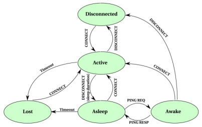

# MQTT-SN 1.2 Specification Interpretation

In our opinion, [the MQTT-SN 1.2 specification][MQTT-SN 1.2] contains some not
very well defined parts which leave some decisions up to a protocol implementer.
This document describes our interpretation of these parts and related decisions
we have made in the Bisquitt MQTT-SN gateway implementation.

## Sleeping clients and the `CONNECT` message

The specification contains a description of a sleeping clients support (Section
6.14, Support of sleeping clients). There is a client's state transition diagram
(Figure 4):

You can see that the `CONNECT` message is used in four different contexts. We
think that in two of them its semantics is to establish a new connection and in
the other it is used as a mean of signalization only.  Unfortunately, the
specification does not explicitly state this. In this section we will discuss
why we consider this distinction important.

The specification only says:

> The CONNECT message is sent by a client to setup a connection. (Section 5.4.4,
> CONNECT)

and does not reflect the sleeping client support explicitly.

The distinction between a `CONNECT` message starting a new connection and one
which only signalizes client's will to leave the _asleep_ or _awake_ state is
important because the `CONNECT` message contains some important
"connection-wide" flags, e.g. the `Will` flag indicating "that client is
requesting for Will topic and Will message prompting" (Section 5.4.4, CONNECT).

Our interpretation of the specification is that:

1. A sleeping client is considered a _connected_ client. In particular, a
   transparent MQTT-SN gateway must keep the corresponding MQTT connection open.
1. `CONNECT` messages in the _asleep_ and _awake_ states (marked with blue dots
   in the image below) only signalize client's will to transition to the
   _active_ state. These messages do _not_ start a new connection.
1. Therefore, their flags should not be used by the client and are ignored by
   the gateway.
1. A client in the _lost_ state is considered disconnected and the corresponding
   MQTT connection is closed.
1. `CONNECT` messages in the _disconnected_ and _lost_ states (marked with red
   dots in the image below) start a new connection and all their flags are in
   effect as described by the specification.

### Justification

If the "blue-dotted" `CONNECT` messages' flags were significant, all the
connection-setting mechanisms would be in effect at each sleeping client's
awakening. This would non-trivially complicate a transparent gateway
implementation and would also lessen the difference between sleeping and
disconnected client.

Our understanding of the main idea of the MQTT-SN-introduced sleeping clients
concept is to support energy-restricted clients which can't waste energy to keep
the connection open but also do not want to introduce periodic re-connecting.
As the specification states:

> Sleeping clients are clients residing on (battery-operated) devices that want
> to save as much energy as possible. These devices need to enter a sleep mode
> whenever they are not active, and will wake up whenever they have data to send
> or to receive. (Section 6.14, Support of sleeping clients)

We conclude that a sleeping client is connected but silent and accessible only
in well-defined time frames.

Hence, we also think that a sleeping client should be seen as connected on the
MQTT broker side and therefore its corresponding MQTT connection must be kept
open by the (transparent) gateway.

[MQTT-SN 1.2]: https://www.oasis-open.org/committees/download.php/66091/MQTT-SN_spec_v1.2.pdf
